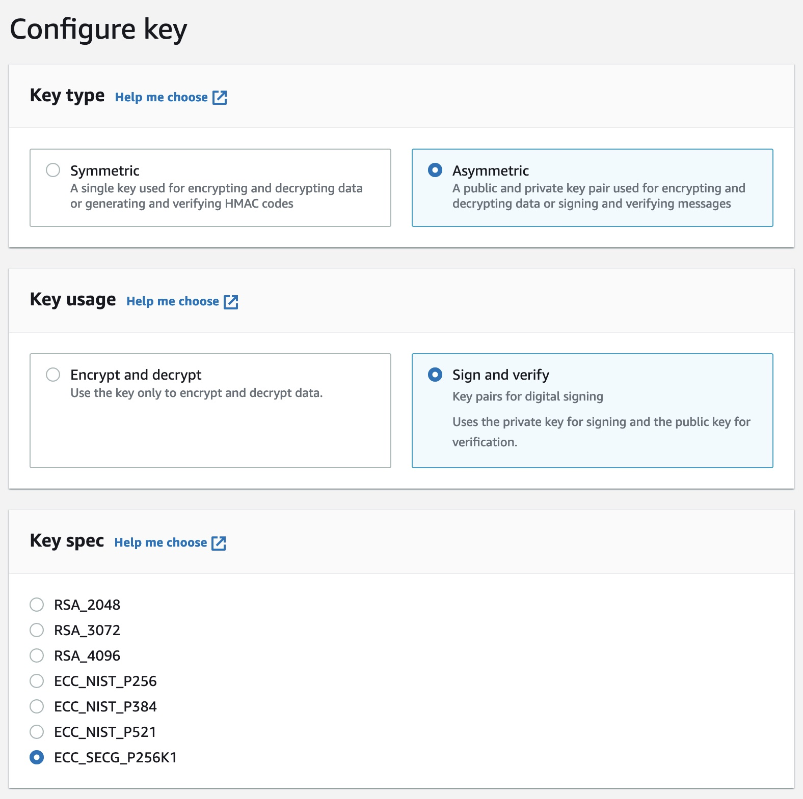

# Register a wallet controlled by an AWS KMS key on ImmutableX

This script registers a wallet controlled by an AWS KMS key on ImmutableX.

## AWS KMS key setup

You need to create an asymmetric AWS KMS key compatible with the Ethereum network. Use the following settings:

<!-- Image showing the settings -->



## Setup AWS profile

The recommended way to use the script is to setup an AWS profile in the console running the script. Alternatively, you can set the `AWS_ACCESS_KEY_ID` and `AWS_SECRET_ACCESS_KEY` environment variables.

## Configure environment variables

Create a copy of the `.env.example` file and name it `.env`. Then, fill in the following environment variables:

-   `AWS_KMS_REGION`: the region of the AWS KMS key
-   `AWS_KMS_KEY_ID`: the ID of the AWS KMS key

The other environment variables are optional.

## Preparing the script

Install the dependencies of the script:

```bash
yarn install
```

## Run the script

To run the script execute the following command:

```bash
yarn register
```
